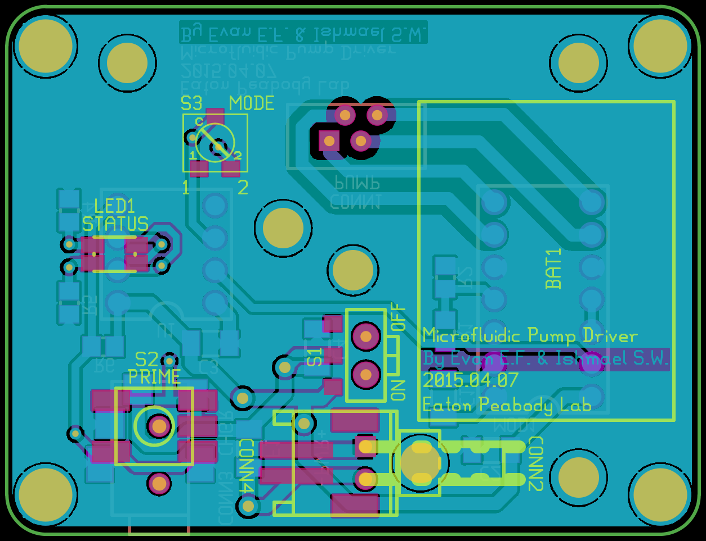

# EPL Micropump Hardware

This project was the hardware to be accompanied by the <a href="https://github.com/EPL-Engineering/epl_impup-fw">EPL Micropump Firmware</a> which is <a href="https://github.com/evanfoss/epl_micropumpfw">mirrored here</a>. The pair of projects is a wearable intracochlear drug delivery pump.

WARNING: This device is not for use on humans. It was experimental and not intended for actual medical use.

## History
1. The initial version was done by Ishmael S. Wagner it was built in a large inclosure from Bud Industries.
2. The 2nd version was built based on the original by Evan Foss & Ishmael S. Wagner. It fit in an enclosure 3D printed and covered in kapton tape by Draper Lab.
3. The 3rd version was a revision on the 2nd by Evan Foss & Ishmael S. Wagner. The board was produced but the project was canceled by the PI.

### Acknowledgements

I would like to thank Dianna Sands for the suggestion of using a balloon as the reservior.

## Specifications

* Small size
* Low weight
* Long battery life (+1 Week)
* Rechargable batteries
* Consisten flow rate and pressure over whole operating life
* Status indicator LEDs
* Pushbutton to prime fluid lines
* 2 Position switch to set operating mode (optional)
* Potentiometer to set flow rate (optional)

# Development

## Toolchain

The development toolchain was as follows:

|Tool Name                                                                                   | License           | Function
|:---------------                                                                            | :-------------    | :-----------------
|<a href="https://github.com/lepton-eda/lepton-eda">lepton-eda</a>                           | Open Source       | EDA (Electronic Design Automation) suite lepton-eda a fork of gEDA
|<a href="http://repo.hu/projects/pcb-rnd/">pcb-rnd</a>                                      | Open Source       | CAD (Computer Aided Design) tool for PCB (Printed Circuit Board) layout gEDA/PCB
|<a href="https://gerbv.github.io/">gerbv</a>                                                | Open Source       | Gerber viewer
|<a href="https://www.gnu.org/software/make/">GNU/Make</a>                                   | Open Source       | Toolchain automation

Note: The CAD drawings for the 3D printed case are lost to history is the name of the software used to draft them.

## Circuit Design

|
|:---------------
|Sch1: micropumpdrv.sch

The device is based around the Bartels <a href="https://bartels-mikrotechnik.de/wp-content/uploads/2025/03/mp6-accessories-Catalogue-v1.11.pdf">microfluidic pump</a> that is piezo electric. The <a href="https://www.servoflo.com/images/PDF/mp6-oem-manual.pdf">pump driver</a> had an integrated DC/DC converter.

The wide operating voltage of the pump driver's DC/DC converter and the microcontroller's wide operating voltage the whole circuit can run off battery without any added voltage regulation.

The LED's and the pump are connected to output lines on the microcontroller. The switches are connected to inputs. Debounce of the switch is handled in firmware.

The pump driver module configuration is inspired by page 10 of the datasheet. Speed is set by the pulse train from the microcontroller output.

|
|:---------------
|Sch2: power.sch

The power supply is just a fuse, on/off switch, and a fuse. There was some concern about a short triggering thermal runaway of the battery.

|
|:---------------
|Sch3: hidden.sch

The boxes in Sch3 is there to make the PCB software add boxes to help me track some mechanical keepouts etc that otherwise don't map to devices with pins.

## Printed Circuit Board Layout

|
|:---------------
|PCB1: Rendering of the 2nd version of the device. This was the first wearable version.

The 1st version of the layout shown in PCB1 had a bug that shorted the +V rail to ground but this was fixed later. As it was the board still technically worked but with a very short battery life (1day vs +1week).

|
|:---------------
|PCBA1: Top of the PCBA with the schematic for the micropumpdrv.sch sitting under it and a fine point sharpie for scale.

|
|:---------------
|PCBA2: Bottom of the PCBA with the same objects around it for scale

The PCB as shown required a little rework later. More on that later.

## Assembly

|
|:---------------
|ASSY1: The top cover with PCBA installed in it.

|
|:---------------
|ASSY2: The top and bottom of the device disassembled. The battery and pump in the bottom of the image.

This is the first working version.

I really didn't like the battery clip's protruding metal spring clip. That was meant to be changed in the next version.

## Future

Well there was the canceled version shown in PCBA2 meant to fit the bottom case in ASSY3.

|
|:---------------
|PCB2: Rendering of the 3rd version of the device.

PCB2 is the last designed version. The PCB was fabricated and an enclosure made but work stopped there. For those wondering about exposed connections unlike the prototype almost all sockets are surface mount. Exposed connections would probably have been covered with RTV-748 or a think cover would have been 3D printed too.

|
|:---------------
|ASSY3: Photo of the bottom of the case provided by the team over at Draper.

The denser layout of PCB2 was made possible by the DIP sockets that are SMT mounting. This makes using both sides of the PCB much simpler but it means the PCB basically must be hand populated.

The added holes in the PCB are for a few reasons. The center hole is for a thumb screw that was meant to go into the chassis where a threaded shaft was meant to hold the PCB down. The other holes were for winding the battery wires through the board for strain relief. The idea was to mount the battery to the PCB and just replace the whole PCB and battery assembly when recharging is required and to have the pump, tubing, and reservior mounted in the bottom of the chassis. The PCBA was intended to be the lid.

A more advanced pump capable of pumping in both directions instead of relying on back pressure to cause mixing would have been am improvement but Bartels didn't make a device like that at the time. 

A tuned cavity should be added to the fluidic circuit to reduce acoustic noise from the pump. Draper did a design after ours that never quite worked but it attempted to impliment the whole design in layers of kapton that were laser cut and welded. This was folly for a few reasons but the tuned cavity should be revisited.

At the time EPL didn't have the ability to do 3D CAD so if it was to happen again a redesign would not be using an outside company for the chassis.

