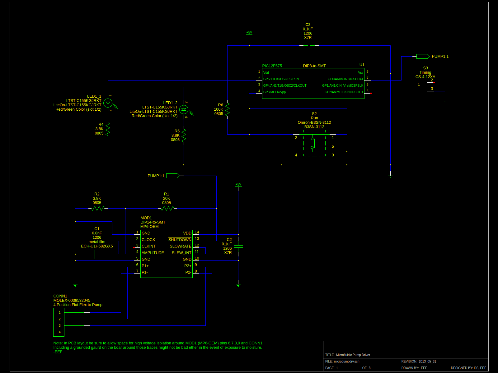

# EPL Micropump Hardware

This project was the hardware to be accompanied by the <a href="https://github.com/EPL-Engineering/epl_impup-fw">EPL Micropump Firmware</a> which is <a href="https://github.com/evanfoss/epl_micropumpfw">mirrored here</a>. The pair of projects is a wearable intracochlear drug delivery pump.

## History
1. The initial version was done by Ishmael S. Wagner it was built in a large inclosure from Bud Industries.
2. The 2nd version was built based on the original by Evan Foss & Ishmael S. Wagner. It fit in an enclosure 3D printed and covered in kapton tape by Draper Lab.
3. The 3rd version was a revision on the 2nd by Evan Foss & Ishmael S. Wagner. The board was produced but the project was canceled by the PI.

### Acknowledgements

I would like to thank Dianna Sands for the suggestion of using a balloon as the reservior.

## Specifications

It had to fit in a very small package, operate for over a week on a battery charge, and it had to be able to quietly move the fluid. Perhaps the most important requirement was that the fluid flow rate and pressure not vary with battery state of charge.

# Development

## Toolchain

The development toolchain was as follows:

|Tool Name                                                                                   | License           | Function
|:---------------                                                                            | :-------------    | :-----------------
|<a href="https://github.com/lepton-eda/lepton-eda">lepton-eda</a>                           | Open Source       | EDA (Electronic Design Automation) suite lepton-eda a fork of gEDA
|<a href="http://repo.hu/projects/pcb-rnd/">pcb-rnd</a>                                      | Open Source       | CAD (Computer Aided Design) tool for PCB (Printed Circuit Board) layout gEDA/PCB
|<a href="https://gerbv.github.io/">gerbv</a>                                                | Open Source       | Gerber viewer
|<a href="https://www.gnu.org/software/make/">GNU/Make</a>                                   | Open Source       | Toolchain automation

Note: The CAD drawings for the 3D printed case are lost to history is the name of the software used to draft them.

## Circuit Design

## Printed Circuit Board Layout

## Future

